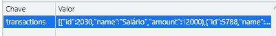

	

<h1 align="center">Controle de despesas!</h1>
<p align="center">Projeto simples que tem como objetivo o controle das suas despesas de forma organizada!</p>

## ⭐ Projeto Finalizado ⭐
[Teste aqui!](https://fuckners.github.io/controle-de-despesas/)

## Tencologias usadas 👾
	
- Typscript

## Sumário:    
- [Sumário:](#sumário)
- [Funcionalidades](#funcionalidades)
- [Páginas](#páginas)
- [Desenvolimento](#t1)
	- [Primeira verão](#subt1)
	- [Segunda versão](#subt2)
- [Conclusão](#conclusão)
- [Autor](#autor)

<span id="funcionalidades"></span>
## Funcionalidades 📌

- [x] Adição de despesas/receitas;
- [x] Alteração dinâmica de saldo atual;
- [x] Alteração dinâmica das despesas/receitas;
- [x] Botões para vizualidar despesas;
- [x] Armazenamento de dados no localStorage;

<span id="paginas"></span>
## Páginas 🚢

<div align="center">
	 <br/>
	 <br>
	
</div>

<span id="t1"> </span>
## Desenvolvimento 🐱‍💻

Este é um projeto cujo o template foi disponibilizado pelo [Roger Melo](https://www.youtube.com/watch?v=xarRciYWT5Q&list=PLpSJMw6H4PFMOJHMULTxKNOEw7g1cBuyP&index=9) como forma de exercício javascript. Porém, por mais que seja um exercício focado mais na lógica do que na linguagem em si, aproveitei para usa-lo como meio para treinar o TypeScript.

<span id="subt1"> </span>
### Versão 01

<p align="justify">A princípio eu apenas peguei o template do projeto e tentei fazer seguindo a propósta do exercício.</p>
<p align="justify">Por mais que eu tenha conseguido fazer o código de primeira, confesso que demorei mais do que gostaria e senti que ele ficou um pouco confuso. Então para o segundo round, decidi dar uma espiadinha em qual lógica o Roger tinha seguido...</p>

<span id="subt2"> </span>
### Segunda Versão 🙆‍♂️

... E lá estava ela! A linha que mudou tudo.
```ts
let globalTransactions :Array<transaction> = JSON.parse(localStorage.getItem('transactions')!) || [];
```
<p align="justify">Minha maior dificuldade inicialmente tinha sido em relação a como guardar as variáveis no localStorage. A princípio, toda vez que eu precisasse atualizar o localStorage, eu colocava os valores em uma variavel local, alterava conforme preciso, e salvava novamente.</p>
Porém, por mais que meu código original tenha ficado do mesmo tamanho que o do Roger, eu senti que isso era algo trabalhoso de ficar fazendo o tempo todo.
<p align="justify">A sacada do roger foi criar uma variavel global que recebia o valor do localStorage, e sempre que precisasse alterar esse valor, ele chamava essa variavel e depois atribuia o valor dela no localStorage novamente, mantendo assim ela sempre atualizada.</p>

<p align="justify">Para não ser injusto, confesso que também tiveram algumas outras sacadas que foram bastante inteligentes. Como, por exemplo, o fato de que antes eu usava 4 variaveis no localStorage para armazenar os meus dados.<p>


<p align="justify">Uma para cada informação na tela. Mas isso não era muito confiável considerando que eu poderia alterar o valor do saldo sem afetar a receita ou as despesas. Já na segunda versão, invés de ter 4 variaveis, existe apenas uma onde ficam guardados os dados das transações e esses dados são usados para calcular todos as outras informações necessárias na tela.</p>



Olhando para trás agora, por mais que a princípio eu tenha feito várias variaveis para que não precisasse recalcular todos os valores todas as vezes que houvesse uma atualização eu não acho que isso teria realmente alguma significância que vá gerar um real problema quesito desempenho.

<span id="conclusao"> </span>
### Conclusão
<p align="justify">E finalmente chegamos ao fim 😁!. Espero que se tenha lido tudo, tenha gostado e conseguido entender tudo o que eu tinha em mente.</p>
<p align="justify">Como eu disse antes, por mais que eu tenha levado amis tempo que o esperado no projeto (e muito, muito mais tempo na documentação), eu me diverti bastante e não me arrependo nem um pouquinho! Seguirei fazendo mais alguns projetos do Roger e nas próximas vezes não vai ter pra ninguém 😎</p>


<span id="contact"> </span>
### Autor
<a href="https://github.com/Fuckners/Fuckners">
 
 <br>
 <sub><b>Felipe Fuckner Clariano</b></sub>
</a>
 
 Entre em contato! 💌
 
[](https://www.linkedin.com/in/felipe-fuckner-b65a49237) 
[](mailto:felipefclariano04@gmail.com)
