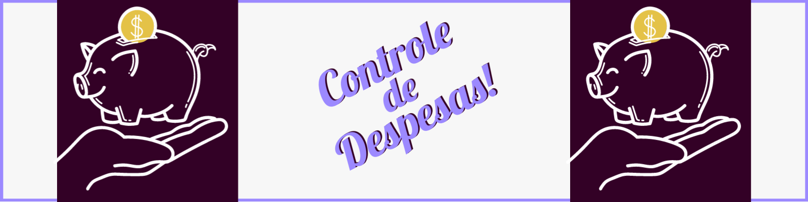

	

<h1 align="center">Controle de despesas!</h1>
<p align="center">Projeto simples que tem como objetivo o controle das suas despesas de forma organizada!</p>

## ⭐ Projeto Finalizado ⭐

## Tencologias usadas 👾
	
- Typscript

## Sumário:    
- [Sumário:](#sumário)
- [Funcionalidades](#funcionalidades)
- [Páginas](#páginas)
- [Tópico 01](#tópico-01)
	- [Subtópico 01](#subtópico-01)
		- [Sub sub tópico](#sub-sub-tópico)
	- [Subtópico 02](#subtópico-02)
	- [Conclusão](#conclusão)
- [Instalação](#instalação)
	- [Pré-requisitos](#pré-requisitos)
		- [Rodando o projeto](#rodando-o-projeto)
	- [Autor](#autor)

<span id="funcionalidades"></span>
## Funcionalidades 📌

- [x] Adição de despesas/receitas;
- [x] Alteração dinâmica de saldo atual;
- [x] Alteração dinâmica das despesas/receitas;
- [x] Botões para vizualidar despesas;
- [x] Armazenamento de dados no localStorage;

<span id="paginas"></span>
## Páginas 🚢
<div align="center">
	<h3>Grupo 1</h3>
	
	
	<h3>Grupo 2</h3>
	
	<h3>Grupo 2</h3>
	
	
	
    <br/>...
</div>

<span id="t1"> </span>
## Tópico 01
Agora vamos falar um pouquinho sobre a trajetória percorrida durante a criação do projeto.
<span id="subt1"> </span>
### Subtópico 01 🐱‍💻
Texto sobre o que deseja abordar no tópico...
```js
// Códigos exemplos (opcional)
```
	
#### Sub sub tópico
Texto sobre...
```js
// Código exemplo (opcional)
```


<span id="subt2"> </span>
### Subtópico 02
<p align="justify">Texto (Só precisa colocar dentro das tags **p** caso o texto seja muito grande e precise ficar justificado)</p>

<span id="conclusao"> </span>
### Conclusão
<p align="justify">Texto de conclusão explicando o que você aprendeu, observações importantes, etc</p>

<span id="instalacao"> </span>
## Instalação	

### Pré-requisitos

Antes de começar, você vai precisar ter instalado em sua máquina as seguintes ferramentas: [Feramenta01](https://linkFerramenta01) e [Ferramenta02](https://LinkFerramenta02). 
Além disto é bom ter um editor para trabalhar com o código como [VSCode](https://code.visualstudio.com/)

<span id="runprojeto"> </span>
#### Rodando o projeto
```bash
# Abra o cmd.

# Navegue até a pasta do projeto.
$ cd <diretório>/chataralho

# Instale as dependências do projeto.
$ npm install

# Execute a aplicação
$ node server.js

# O servidor inciará na porta:6847

# Acesse <http://localhost:6847>

# Converse com seus amigos até enjoar!
```

<span id="contact"> </span>
### Autor
<a href="https://github.com/Fuckners/Fuckners">
 
 <br>
 <sub><b>Felipe Fuckner Clariano</b></sub>
</a>
 
 Entre em contato! 💌
 
[](https://www.linkedin.com/in/felipe-fuckner-b65a49237) 
[](mailto:felipefclariano04@gmail.com)
